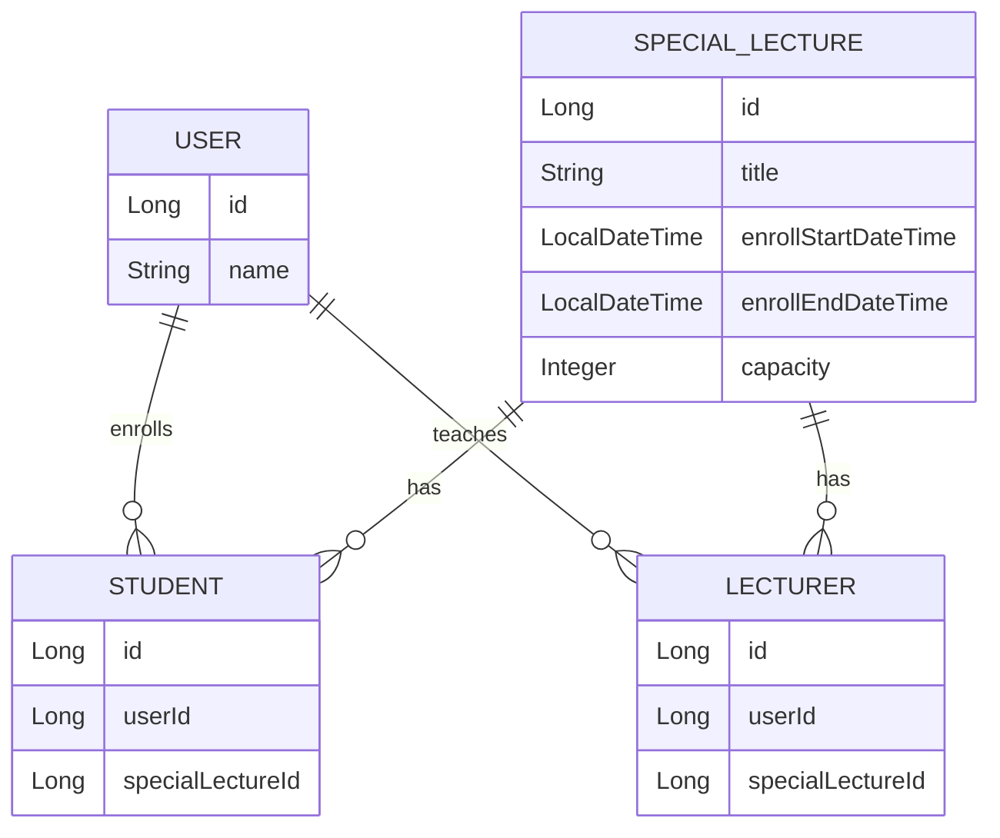

# ERD

## 기본 가정
- 유저는 수상생이 되거나 강연자가 될 수 있다고 가정

## 특강과 수강생
- 유저는 여러 특강을 신청할 수 있다
- 특강도 여러 유저를 받을 수 있다
- 유저:특강 -> N:M 관계로 이해
- 중간에서 1:N M:1 로 풀어줄 Student Entity 생성

## 특강과 강연자
- 유저는 여러 특강을 강연할 수 있다
- 특강도 여러 강연자를 가지고 있을 수 있다
- 유저:특강 -> N:M 관계로 이해
- 중간에서 1:N M:1 로 풀어줄 Lecturer Entity 생성
